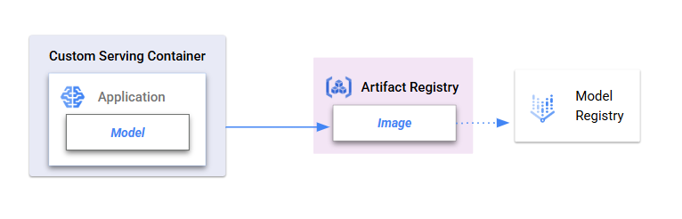

# custom-serving-container

This project showcases a method to build a custom serving container to register an ONNX model on Vertex AI.

## Getting started

Once the prerequisites have been met and the user parameters are specified, users can follow the notebook to run through the guided steps.

### Notebooks

* [01-custom-serving-container.ipynb](./01-custom-serving-container.ipynb) : This notebook trains a model that is serialized into ONNX format. The model is registered using custom serving containers, ready to serve batch predictions.

### Prerequisites

Ensure the project environment, network settings, and service accounts used have the appropriate google cloud authentication and permissions to access the folloiwng services:
- `Vertex AI`
- `Cloud Storage`
- `Artifact Registry`

## Workflow

